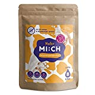

Hafermilch wird oft in Tetra-Packs verkauft. Diese lassen sich aber sehr einfach vermeiden.

===

## Hafermilch in Glas-Flaschen

In manchen Supermärkten gibt es Hafermilch in Glas Flaschen zu kaufen. Leider habe ich bisher noch keinen Supermarkt in meiner Nähe gefunden. Daher erwähne ich diese Möglichkeit proforma.

## Hafermilch aus Pulver selber herstellen

Was für mich deutlich besser funktioniert hat, ist das herstellen von Hafermilch mit Pulver. Der Verpackung des Pulvers enthält zwar Plastik, aber deutlich weniger als bei einem üblichen Tetra-Pack. Der große Vorteil ist außerdem, das die Transportkosten deutlich geringer sind, da man das Wasser zum Mischen einfach aus dem Wasserhahn bekommt.

| Image | Text | Preis | Link |
|-------|--------|--------|--------|
|  | NUTRIFY Haferdrink-Pulver glutenfrei 1000 g für 8 Liter | ca. 20,99 Euro | [Amazon (*)](https://amzn.to/3QGjUiB) |
|  | Drink MI:CH Haferdrink Pulver 1000 g für 8 Liter | ca. 16,27 Euro | [Amazon (*)](https://amzn.to/3GMr4gt) |
|  | Blue Farm Oat Base Classic 8L | ca. 17,19 Euro | [Amazon (*)](https://amzn.to/3iLgHlh) |

 \* *Dies ist ein Affiliate-Link. Wenn du über diesen Link einen Kauf tätigst, erhalten wir eine Provision. Die Erstellung der Listen kostet Zeit und auch etwas Geld für die Technik, wir möchten uns durch die Provision finanzieren.*