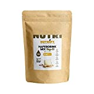
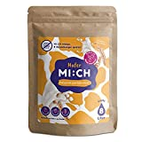
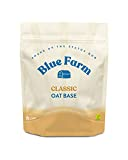

Oat milk is often sold in tetra packs. But these are very easy to avoid.

===

## Oat milk in glass bottles

In some supermarkets you can buy oat milk in glass bottles. Unfortunately, I have not yet found a supermarket near me. Therefore, I mention this possibility pro forma.

## Making your own oat milk from powder

What has worked much better for me is making oat milk with powder. The packaging of the powder does contain plastic, but much less than a standard tetra pack. The big advantage is also that the transport costs are much lower, because you can just get the water for mixing from the tap.

| Image | Text | Preis | Link |
|-------|--------|--------|--------|
|  | NUTRIFY Haferdrink-Pulver glutenfrei 1000 g für 8 Liter | ca. 20,99 Euro | [Amazon (*)](https://amzn.to/3QGjUiB) |
|  | Drink MI:CH Haferdrink Pulver 1000 g für 8 Liter | ca. 16,27 Euro | [Amazon (*)](https://amzn.to/3GMr4gt) |
|  | Blue Farm Oat Base Classic 8L | ca. 17,19 Euro | [Amazon (*)](https://amzn.to/3iLgHlh) |

 \* *This is an affiliate link. If you make a sale through this link, we will receive a commission. The creation of the lists costs time and also some money for the technology, we would like to finance ourselves through the commission.*