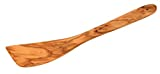
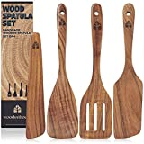

Hier finden Sie eine Liste von Pfannenwender zum Kochen ohne Plastik. Eine Sache, die mich schon immer gestört hat, war die Verwendung von Plastikspateln zum Umrühren meiner Speisen. Das Problem ist, dass diese in der Regel schmelzen, wenn sie heiß werden.

===

Hier finden Sie eine Liste von Pfannenwender zum Kochen ohne Plastik. Unterhalb der Liste finden Sie weitere Texte über Pfannenwender.

| Image | Text | Preis | Link |
|-------|--------|--------|--------|
|  | Fackelmann Pfannenwender 30 cm OLIVE | ca. 7,95 Euro | [Amazon (*)](https://www.amazon.de/FACKELMANN-Pfannenwender-K%C3%BCchenhelfer-Oliven-Holz-unverkennbarer/dp/B000MV4CME?keywords=holz%2Bpfannenwender&qid=1673123560&sprefix=holz%2Bpf%2Caps%2C513&sr=8-7&th=1&linkCode=ll1&tag=ledlampvergde-21&linkId=28352aa194ec2827b5692462de5d290c&language=de_DE&ref_=as_li_ss_tl) |
|  | Holz Pfannenwender-Set & Kochlöffel-Set | ca. 23,99 Euro | [Amazon (*)](https://amzn.to/3IGijHy) |

 \* *Dies ist ein Affiliate-Link. Wenn du über diesen Link einen Kauf tätigst, erhalten wir eine Provision. Die Erstellung der Listen kostet Zeit und auch etwas Geld für die Technik, wir möchten uns durch die Provision finanzieren.*

Eine Sache, die mich schon immer gestört hat, war die Verwendung von Plastikspateln zum Umrühren meiner Speisen. Das Problem ist, dass diese in der Regel schmelzen, wenn sie heiß werden, was zu Klumpen im Essen führen kann und es schwieriger macht, zu kontrollieren, wie viel in jedes Gericht kommt. Wenn Sie es auch leid sind, sich mit schmelzenden Plastiklöffeln und -gabeln herumzuschlagen, dann haben wir gute Nachrichten! Es gibt eine Vielzahl von Holzspateln, die nicht schmelzen, wenn sie zu heiß werden - und noch besser: Sie enthalten keine schädlichen Chemikalien oder Giftstoffe wie Plastik! In diesem Artikel stellen wir Ihnen verschiedene Arten von Holzspateln vor (darunter auch solche aus Bambus) und erklären, warum sie Ihre Hände beim Kochen schützen und wie viel angenehmer sie sich im Vergleich zu Plastikspateln anfühlen

## Es gibt Holzspatel, die nicht aus Plastik sind.

Es gibt viele verschiedene Arten von Holzspateln, aber sie haben alle eines gemeinsam: Sie sind aus Holz oder einem anderen Material hergestellt. Es gibt viele verschiedene Holzarten, die für diesen Zweck verwendet werden, aber Bambus ist oft das beliebteste, weil es erneuerbar ist und keine Giftstoffe enthält wie andere Polymere. Holz eignet sich nicht nur gut zum Kochen, es verströmt auch ein angenehmes Aroma beim Kochen! Wenn du in deiner Küche kein Plastik verwenden möchtest, weil dir die schädlichen Auswirkungen auf die Umwelt und unseren Körper nicht wert sind (und mir auch nicht), dann solltest du dir stattdessen ein paar Holzlöffel kaufen!

## Du findest einen für jede Aufgabe: Rühren, Wenden etc.

Sie möchten vielleicht einen für jede Aufgabe, die Sie erledigen, wie Rühren, Wenden und Verteilen. Wir haben eine Auswahl an robusten Pfannenwendern, die aus Holz und nicht aus Kunststoff gefertigt sind. Diese Holzspatel können für alle Arten von Aufgaben in der Küche verwendet werden, z. B. zum Schneiden von Kartoffeln in Pommes frites mit einem Messer oder zum Auftragen von Teig auf Backbleche mit der richtigen Menge Mehl.

## Wenn Sie einen Pfannenwender aus Kunststoff verwenden, kann der Kunststoff zu schmelzen beginnen.

Dies führt zu gesundheitlichen Problemen für Ihre Familie und die Umwelt. Das andere Problem ist, dass Sie das Essen in Ihrer Küche mit diesem Pfannenwender wegwerfen, was glauben Sie, was dann passiert? Sie werden etwas wegwerfen, das Geld kostet und wiederverwendet werden könnte, wenn Sie kein Plastik verwenden würden!

## Holz schmilzt nicht, wenn es heiß wird, so dass man sich keine Sorgen um geschmolzene Spatel im Essen machen muss.
Außerdem sind sie leicht zu reinigen, was bedeutet, dass sie länger halten als Plastikspatel.

Pfannenwender aus Holz eignen sich besonders gut zum Grillen, da man sie zum Wenden der Speisen verwenden kann. Wenn du etwas willst, das haltbar und langlebig ist, aber nicht viel Geld kostet (und dafür ewig hält), dann sind Holzspatel genau das Richtige für dich!

## Fazit

Wir hoffen, dass diese Liste von Küchenspateln Ihnen geholfen hat, sich für den besten Spatel für Ihre Bedürfnisse zu entscheiden. 