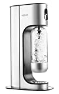
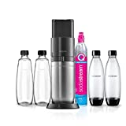

Verschiedene Arten von Wassersprudlern fast ohne Plastik. Eine einfache und kostengünstige Möglichkeit, dem Leitungswasser Kohlendioxid hinzuzufügen. Sie brauchen keine Plastikflaschen mehr und müssen kein Wasser mehr aus dem Supermarkt schleppen.

===

Leider ist es quasi **unmöglich einen Wassersprudlern komplett ohne Plastik** zu finden, da im inneren immer Plastik zu finden ist für Schläuche etc. Allerdings kann man darauf achten, dass das Gehäuse aus Metall ist und die Flaschen aus Glas.

| Image | Text | Preis | Link |
|-------|--------|--------|--------|
|  | AARKE Carbonator Pro | ca. 266,99 Euro | [Amazon (*)](https://amzn.to/3XncW4J) |
|  | Aqvia Exclusive Wassersprudler (**Flaschen aus PET**) | ca. 39,99 Euro | [Amazon (*)](https://amzn.to/3QCdwJ8) |
|  | SodaStream Wassersprudler DUO (**Flaschen aus Glas / Gehäuse aus Plastik**) | ca. 130,00 Euro | [Amazon (*)](https://amzn.to/3QC4nA7) |

 \* *Dies ist ein Affiliate-Link. Wenn du über diesen Link einen Kauf tätigst, erhalten wir eine Provision. Die Erstellung der Listen kostet Zeit und auch etwas Geld für die Technik, wir möchten uns durch die Provision finanzieren.*
