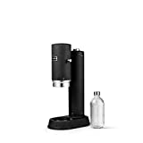
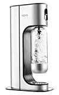
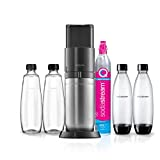

Different types of water carbonators almost without plastic. A simple and inexpensive way to add carbon dioxide to tap water. No more need for plastic bottles and no more lugging water from the supermarket.

===

Unfortunately, it's almost impossible to find a water sprinkler completely without plastic, as there is always plastic inside for hoses, etc. You can, however, make sure that the water is made of plastic. However, you can make sure that the housing is made of metal and the bottles are made of glass.

| Image | Text | Preis | Link |
|-------|--------|--------|--------|
|  | AARKE Carbonator Pro | ca. 266,99 Euro | [Amazon (*)](https://amzn.to/3XncW4J) |
|  | Aqvia Exclusive water carbonator (**Flaschen aus PET**) | ca. 39,99 Euro | [Amazon (*)](https://amzn.to/3QCdwJ8) |
|  | SodaStream Wassersprudler DUO (**Flaschen aus Glas / Gehäuse aus Plastik**) | ca. 130,00 Euro | [Amazon (*)](https://amzn.to/3QC4nA7) |

 \* *This is an affiliate link. If you make a sale through this link, we will receive a commission. The creation of the lists costs time and also some money for the technology, we would like to finance ourselves through the commission.*
