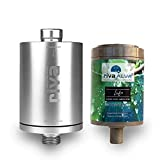
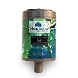
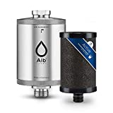
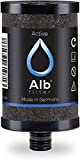

Mit Hilfe von Wasserfiltern kann der Geschmack von Leitungswasser deutlich verbessert werden. Außerdem lassen sich schädliche Stoffe entfernen.

===

Die Auswahl an Wasserfiltern komplett ohne Plastik ist sehr Eingeschränkt. Nach sehr langer Recherche konnte ich nur einen Anbieter finden der einen Wasserfilter inkl. Kartuschen ohne Plastik anbietet. Trotzdem stelle ich hier noch weitere Varianten vor die zwar Plastik enthalten, aber etwas weniger kosten.

## Wasserfilter komplett ohne Plastik (Teuer)

Der Anbieter **riva** bietet einen Wasserfilter der aus Aluminium gefertigt ist. Es gibt verschiede Varianten wie z.B. Untertisch oder aber auch welche die an den Wasserhahn angeschlossen werden.

Das besondere ist, das auch die Filter-Kartuschen (müssen ab und zu gewechselt werden) komplett ohne Plastik angeboten werden. Es besteht aus einem **bioganischem** Material welches komplett aus aus **nachwachsenden Rohstoffen** hergestellt wird.

| Image | Text | Preis | Link |
|-------|--------|--------|--------|
|  | rivaALVA Life Trinkwasserfilter (**Untertisch**) | ca. 124,90 Euro | [Amazon (*)](https://amzn.to/3CPyX3I) |
|  | rivaALVA-S Viva (**Wasserhahn**) | ca. 119,90 Euro | [Hersteller Shop](https://riva-filter.de/produkt/rivaalva-s-viva-trinkwasserfilter-wasserhahn/) |
|  | rivaALVA Life Trinkwasserfilter Ersatzkartusche | ca. 34,90 Euro | [Amazon (*)](https://amzn.to/3w7tjpK) |

 \* *Dies ist ein Affiliate-Link. Wenn du über diesen Link einen Kauf tätigst, erhalten wir eine Provision. Die Erstellung der Listen kostet Zeit und auch etwas Geld für die Technik, wir möchten uns durch die Provision finanzieren.*

## Wasserfilter mit Plastik (Günstiger)

Es gibt auch eine Reihe von Wasserfiltern, bei denen zwar das Grundgehäuse aus Metall besteht, aber die Kartuschen die regelmäßig gewechselt werden müssen sind auch Plastik hergestellt.

### Standard-Filter

Bei Wasserfilter gibt es einen gewissen Standard (5 und 10 Zoll). Bei diesem sind die Gehäuse alle gleich aufgebaut und Kartuschen gibt es von vielen Anbietern. Dadurch lassen diese sicher sehr günstig betreiben.

| Image | Text | Preis | Link |
|-------|--------|--------|--------|
|  | Filtergehäuse aus Edelstahl 10 Zoll 3/4 Zoll IG (**Untertisch**) | ca. 94,95 Euro | [Osmovita Shop](https://www.osmovita.de/filtergehaeuse-edelstahl-10-zoll-3-4-zoll-ig) |
|  | Planet-Aqua Premium Aktivkohle Blockfilter 10 Zoll (**Enthält Plastik!**) | ca. 6,94 Euro | [Amazon (*)](https://amzn.to/3Wm8ulq) |

 \* *Dies ist ein Affiliate-Link. Wenn du über diesen Link einen Kauf tätigst, erhalten wir eine Provision. Die Erstellung der Listen kostet Zeit und auch etwas Geld für die Technik, wir möchten uns durch die Provision finanzieren.*

 ### Alb-Filter
 Die Filter des Herstellers **Alb** sind fast Baugleich zu den **riva** Filtern (s.o.). Leider können die Kartuschen nicht untereinander getauscht werden.

 | Image | Text | Preis | Link |
|-------|--------|--------|--------|
|  | Alb Filter® Active (**Untertisch; Kartusche aus Plastik**) | ca. 118,90 Euro | [Amazon (*)](https://amzn.to/3H9WpeJ) |
|  | Alb Filter® Duo Active (**Wasserhahn; Kartusche aus Plastik**) | ca. 159,90 Euro | [Amazon (*)](https://amzn.to/3WiNL1v) |
|  | Alb Filter® Active Kartusche (**Enthält Plastik!**) | ca. 24,90 Euro | [Amazon (*)](https://amzn.to/3H7zEIb) |

 \* *Dies ist ein Affiliate-Link. Wenn du über diesen Link einen Kauf tätigst, erhalten wir eine Provision. Die Erstellung der Listen kostet Zeit und auch etwas Geld für die Technik, wir möchten uns durch die Provision finanzieren.*