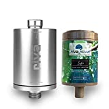
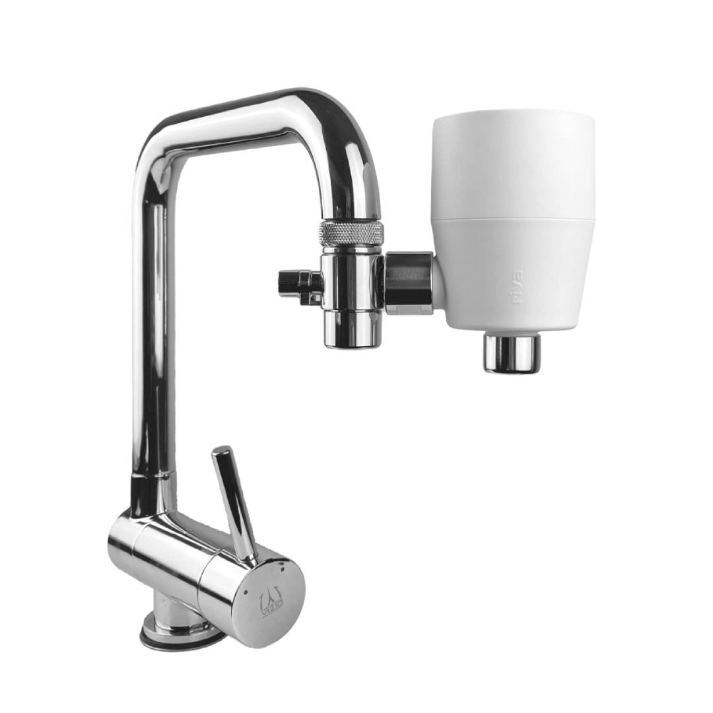
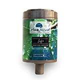
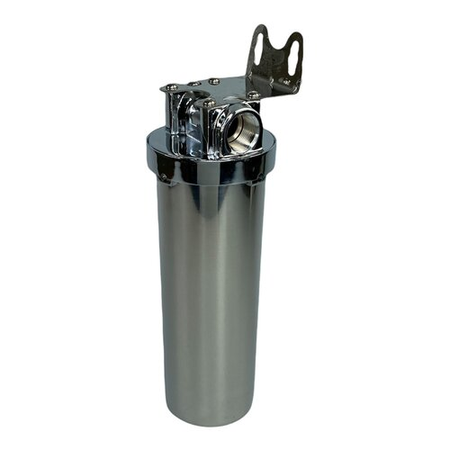
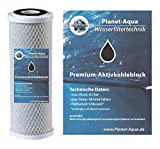
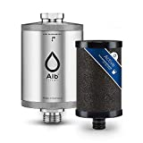
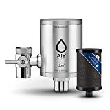
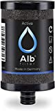

With the help of water filters, the taste of tap water can be significantly improved. In addition, harmful substances can be removed.

===

The choice of water filters completely without plastic is very limited. After a very long search, I could only find one supplier who offers a water filter including cartridges without plastic. Nevertheless, I would like to present some other variants that contain plastic, but cost a little less.

## Water filter completely without plastic (Expensive)

The supplier **riva** offers a water filter made of aluminium. There are different versions, such as under-table or which are connected to the water tap.

The special feature is that the filter cartridges (which have to be changed from time to time) are also offered completely without plastic. It consists of a **bioganical** material which is completely made of **renewable raw materials**.

| Image | Text | Price | Link |
|-------|--------|--------|--------|
|  | rivaALVA Life Trinkwasserfilter (**Untertisch**) | ca. 124,90 Euro | [Amazon (*)](https://amzn.to/3CPyX3I) |
|  | rivaALVA-S Viva (**Wasserhahn**) | ca. 119,90 Euro | [Hersteller Shop](https://riva-filter.de/produkt/rivaalva-s-viva-trinkwasserfilter-wasserhahn/) |
|  | rivaALVA Life Trinkwasserfilter Ersatzkartusche | ca. 34,90 Euro | [Amazon (*)](https://amzn.to/3w7tjpK) |

 \* *This is an affiliate link. If you make a sale through this link, we will receive a commission. The creation of the lists costs time and also some money for the technology, we would like to finance ourselves through the commission.*

## Water filters with plastic (cheaper)

There are also a number of water filters where the basic housing is made of metal, but the cartridges that need to be changed regularly are made of plastic.

### Standard filters

There is a certain standard for water filters (5 and 10 inch). The housings are all built the same and cartridges are available from many suppliers. This means that they can be operated very cheaply.

| Image | Text | Price | Link |
|-------|--------|--------|--------|
|  | Filtergehäuse aus Edelstahl 10 Zoll 3/4 Zoll IG (**Untertisch**) | ca. 94,95 Euro | [Osmovita Shop](https://www.osmovita.de/filtergehaeuse-edelstahl-10-zoll-3-4-zoll-ig) |
|  | Planet-Aqua Premium Aktivkohle Blockfilter 10 Zoll (**Enthält Plastik!**) | ca. 6,94 Euro | [Amazon (*)](https://amzn.to/3Wm8ulq) |

\* *This is an affiliate link. If you make a sale through this link, we will receive a commission. The creation of the lists costs time and also some money for the technology, we would like to finance ourselves through the commission.*

 ### Alb-Filter
 The filters from the manufacturer **Alb** are almost identical in construction to the **riva** filters (see above). Unfortunately, the cartridges cannot be interchanged.

 | Image | Text | Price | Link |
|-------|--------|--------|--------|
|  | Alb Filter® Active (**Untertisch; Kartusche aus Plastik**) | ca. 118,90 Euro | [Amazon (*)](https://amzn.to/3H9WpeJ) |
|  | Alb Filter® Duo Active (**Wasserhahn; Kartusche aus Plastik**) | ca. 159,90 Euro | [Amazon (*)](https://amzn.to/3WiNL1v) |
|  | Alb Filter® Active Kartusche (**Enthält Plastik!**) | ca. 24,90 Euro | [Amazon (*)](https://amzn.to/3H7zEIb) |

 \* *This is an affiliate link. If you make a sale through this link, we will receive a commission. The creation of the lists costs time and also some money for the technology, we would like to finance ourselves through the commission.*