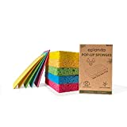
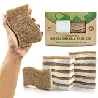

Ersetze deine Schwämme in deinem Haushalt mit welchen ohne Plastik. Es gibt Schwämme die sind komplett mit Naturmaterialen hergestellt und schonen damit die Umwelt.

===

Folgende Schwämme werden komplett ohne Plastik (auch nicht die Verpackung) verkauft:

| Image | Text | Preis | Link |
|-------|--------|--------|--------|
|  | EPLANITA Pop-Up Schwämme (5er Pack) | ca. 6,79 Euro (1,36 € / Stück) | [Amazon (*)](https://amzn.to/3CQ4Clq) |
|  | AIRNEX Biologisch abbaubare Schwämme aus Kokosfaser & Zellulose (12er Pack) | ca. 15,26 Euro (1,27 € / Stück) | [Amazon (*)](https://amzn.to/3Xc4q8m) |
|  | Leander Design® Spülschwamm (4er Pack) | ca. 15,90 Euro (3,97 € / Stück) | [Amazon (*)](https://amzn.to/3w5UzF4) |

 \* *Dies ist ein Affiliate-Link. Wenn du über diesen Link einen Kauf tätigst, erhalten wir eine Provision. Die Erstellung der Listen kostet Zeit und auch etwas Geld für die Technik, wir möchten uns durch die Provision finanzieren.*