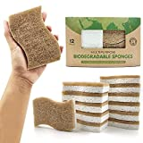
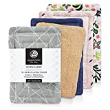

Replace the sponges in your household with plastic-free ones. There are sponges that are made entirely from natural materials and are therefore better for the environment.

===

The following sponges are sold completely without plastic (not even the packaging):

| Image | Text | Preis | Link |
|-------|--------|--------|--------|
|  | EPLANITA Pop-Up Schwämme (5er Pack) | ca. 6,79 Euro (1,36 € / Stück) | [Amazon (*)](https://amzn.to/3CQ4Clq) |
|  | AIRNEX Biologisch abbaubare Schwämme aus Kokosfaser & Zellulose (12er Pack) | ca. 15,26 Euro (1,27 € / Stück) | [Amazon (*)](https://amzn.to/3Xc4q8m) |
|  | Leander Design® Spülschwamm (4er Pack) | ca. 15,90 Euro (3,97 € / Stück) | [Amazon (*)](https://amzn.to/3w5UzF4) |

 \* *This is an affiliate link. If you make a sale through this link, we will receive a commission. The creation of the lists costs time and also some money for the technology, we would like to finance ourselves through the commission.*