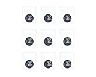
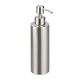
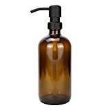

Auch beim Spülmittel (Spüli) kann man sehr einfach auf Plastik verzichten. Mische dein Spüli einfach mit Pulver selber an.

===

Die Auswahl für Spülmittel ohne Plastikflaschen ist sehr gering. Statt Plastik wäre eine Metall- oder Glasflasche die Alternative. So etwas konnte ich aber nicht finden.

Die beste Alternative um hier auf Plastik zu verzichten scheint das verwenden von Pulver zu sein. Nach etwas suchen bin ich auf folgendes Produkt gestoßen. Zusätzlich habe ich noch 2 Flüssigseifenspender rausgesucht.

| Image | Text | Preis | Link |
|-------|--------|--------|--------|
|  | aer Handspülmittel - 9x Nachfüller für Spülmittel (Ergibt je ca. 380ml Spüli) | ca. 15,79 Euro (1,75€ / Stück) | [Amazon (*)](https://amzn.to/3kiFqh6) |
|  | Relaxdays Seifenspender 300ml | ca. 13,95 Euro | [Amazon (*)](https://amzn.to/3Hf6bfy) |
|  | Plomkeest Amber Thick Glass 500ml | ca. 12,95 Euro | [Amazon (*)](https://amzn.to/3ktTSDd) |

 \* *Dies ist ein Affiliate-Link. Wenn du über diesen Link einen Kauf tätigst, erhalten wir eine Provision. Die Erstellung der Listen kostet Zeit und auch etwas Geld für die Technik, wir möchten uns durch die Provision finanzieren.*