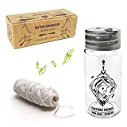
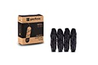
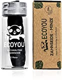

Bevor ich nach Zahnseide ohne Plastik recherchiert habe, war ich skeptisch, ob das möglich ist. Es hat sich aber gezeigt, dass das kein Problem ist.

===

Hier finden Sie eine Liste von Zahnseide Alternativen ohne Plastik.

| Image | Text | Preis | Link |
|-------|--------|--------|--------|
|  | Nature Nerds – plastikfreie Natur Zahnseide im Glas-Flakon gewachst mit Candelilla – 6 Spulen | 180m = ca. 17,99 Euro, 30m = ca. 6,99 Euro | [Amazon (*)](https://amzn.to/3XH8EVM) |
|  | GEORDINARY Nachhaltige Zahnseide mit Bambus-Aktivkohle | 120m = ca. 8,99 Euro | [Amazon (*)](https://amzn.to/3RmbWLN) |
|  | EcoYou Zahnseide nachhaltig aus Bambus-Aktivkohle im plastikfreien, wiederverwendbaren Glas-Flakon | 30m = ca. 6,90 Euro | [Amazon (*)](https://amzn.to/3HBR0NGd) |

 \* *Dies ist ein Affiliate-Link. Wenn du über diesen Link einen Kauf tätigst, erhalten wir eine Provision. Die Erstellung der Listen kostet Zeit und auch etwas Geld für die Technik, wir möchten uns durch die Provision finanzieren.*
