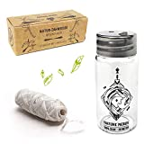
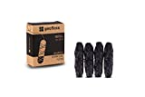
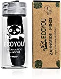

Before I researched plastic-free floss, I was sceptical about whether it was possible. But it turns out that it's not a problem.

===

Here you can find a list of floss alternatives without plastic.

| Image | Text | Preis | Link |
|-------|--------|--------|--------|
|  | Nature Nerds – plastikfreie Natur Zahnseide im Glas-Flakon gewachst mit Candelilla – 6 Spulen | 180m = ca. 17,99 Euro, 30m = ca. 6,99 Euro | [Amazon (*)](https://amzn.to/3XH8EVM) |
|  | GEORDINARY Nachhaltige Zahnseide mit Bambus-Aktivkohle | 120m = ca. 8,99 Euro | [Amazon (*)](https://amzn.to/3RmbWLN) |
|  | EcoYou Zahnseide nachhaltig aus Bambus-Aktivkohle im plastikfreien, wiederverwendbaren Glas-Flakon | 30m = ca. 6,90 Euro | [Amazon (*)](https://amzn.to/3HBR0NGd) |

 \* *This is an affiliate link. If you make a sale through this link, we will receive a commission. The creation of the lists costs time and also some money for the technology, we would like to finance ourselves through the commission.*

