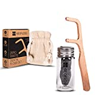

Bevor ich nach Zahnseide-Sticks ohne Plastik recherchiert habe, war ich skeptisch, ob das möglich ist. Es hat sich aber gezeigt, dass das kein Problem ist.

===

Hier finden Sie eine Liste von Zahnseide-Sticks Alternativen ohne Plastik.

| Image | Text | Preis | Link |
|-------|--------|--------|--------|
|  | GEOFLOSS Zahnseide-Halter aus Kupfer | ca. 8,99 Euro | [Amazon (*)](https://amzn.to/3wDbKy5) |

 \* *Dies ist ein Affiliate-Link. Wenn du über diesen Link einen Kauf tätigst, erhalten wir eine Provision. Die Erstellung der Listen kostet Zeit und auch etwas Geld für die Technik, wir möchten uns durch die Provision finanzieren.*
