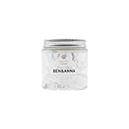
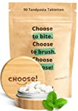
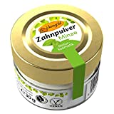

Es wäre sehr einfach Zahnpaste ohne eine Plastikverpackung zu verkaufen. Leider gibt es nur wenige Optionen.

===

Hier finden Sie eine Liste von Zahnpaste ohne Plastikverpackung.

| Image | Text | Preis | Link |
|-------|--------|--------|--------|
|  | Ben&Anna Toothpaste White with Fluoride, 100 ml | ca. 8,49 Euro | [Amazon (*)](https://amzn.to/3XKiAOn) |
|  | CHOOSE Zahnputztabletten mit Bambus Aufbewahrungsbox (100% kompostierbare Beutel) | ca. 16,10 Euro | [Amazon (*)](https://amzn.to/404vU1H) |
|  | Birkengold Zahnpulver Minze | ca. 6,64 Euro | [Amazon (*)](https://amzn.to/3jbJnE6) |

 \* *Dies ist ein Affiliate-Link. Wenn du über diesen Link einen Kauf tätigst, erhalten wir eine Provision. Die Erstellung der Listen kostet Zeit und auch etwas Geld für die Technik, wir möchten uns durch die Provision finanzieren.*
