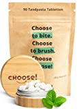
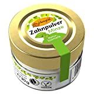

It would be very easy to sell toothpaste without plastic packaging. Unfortunately, there are only a few options.

===

Here you can find a list of toothpaste without plastic packaging.

| Image | Text | Preis | Link |
|-------|--------|--------|--------|
|  | Ben&Anna Toothpaste White with Fluoride, 100 ml | ca. 8,49 Euro | [Amazon (*)](https://amzn.to/3XKiAOn) |
|  | CHOOSE Zahnputztabletten mit Bambus Aufbewahrungsbox (100% kompostierbare Beutel) | ca. 16,10 Euro | [Amazon (*)](https://amzn.to/404vU1H) |
|  | Birkengold Zahnpulver Minze | ca. 6,64 Euro | [Amazon (*)](https://amzn.to/3jbJnE6) |

 \* *This is an affiliate link. If you make a sale through this link, we will receive a commission. The creation of the lists costs time and also some money for the technology, we would like to finance ourselves through the commission.*

